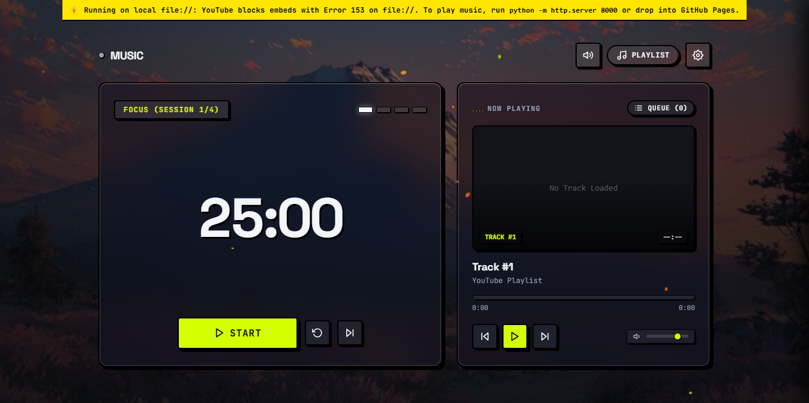

# Muzic ⚡

A minimal, aesthetic **Neo-Brutalist Glass Pomodoro Timer** & **Ambient YouTube Music Player** built with vanilla HTML5, CSS3, and modern JavaScript.

## ✨ Features

- **Neo-Brutalist Glassmorphic UI**: High-contrast typography, electric volt chartreuse accents (`#D4FF00`), and frosted glassmorphism surfaces (`backdrop-filter: blur(28px)`).
- **Ambient Motion Video Background**: Looping ambient mountain landscape video (`bg.mp4`) with customizable toggle.
- **Dual-Depth Floating Autumn Leaves**: Real-time canvas physics with half the foliage floating behind the frosted glass cards (refracting light) and half drifting in the foreground over the UI.
- **Pomodoro Timer Engine**:
  - Focus, Short Break, and Long Break intervals.
  - Procedural Web Audio API sound synthesis for session transition chimes (no external audio files required).
  - Celebration confetti particles on session completion.
- **Hidden YouTube Player & Playlist Engine**:
  - Custom controls for play/pause, next/previous, timeline scrubbing, and volume.
  - Automatic URL parsing for YouTube playlist URLs, video links, shorts, and raw playlist IDs.
  - Dynamic queue drawer with thumbnail previews and track resolution via NoEmbed API.
  - Curated ambient presets (Lofi Chill, Classical Piano, Synthwave Ambient, Nature Deep Work).
- **Keyboard Shortcuts**:
  - <kbd>Space</kbd>: Start / Pause Pomodoro Timer
  - <kbd>P</kbd>: Play / Pause YouTube Player
  - <kbd>J</kbd> / <kbd>K</kbd>: Previous / Next Track
  - <kbd>R</kbd>: Reset Timer
  - <kbd>S</kbd>: Skip Session
  - <kbd>M</kbd>: Mute Sound Effects
  - <kbd>Esc</kbd>: Close Drawer / Modals

---
